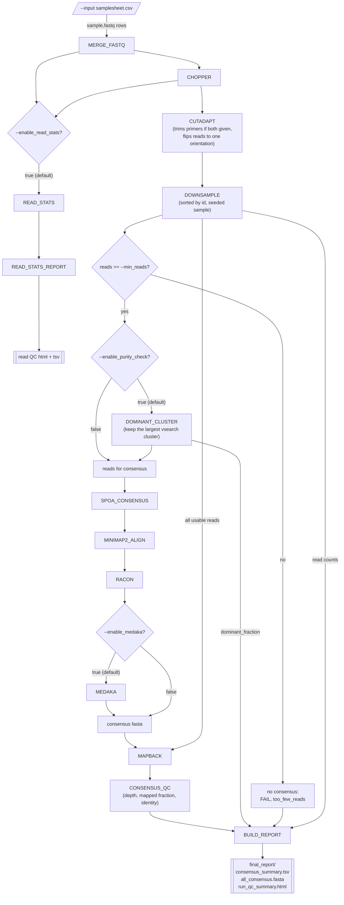

# single-amplicon-nf

A Nextflow (DSL2) pipeline for Oxford Nanopore **single-amplicon** data: one
barcode gene (COI, ITS, rbcL, 16S, ...) per sample, one sample per barcode. It
produces one polished consensus sequence per sample, with per-sample QC.

Sibling of [edna-ont-nf](https://github.com/ehill-iolani/edna-ont-nf) and
[16S-nf](https://github.com/ehill-iolani/16S-nf) (mixed amplicons: many taxa per
sample) and [ulana-nf](https://github.com/ehill-iolani/ulana-nf) (whole genomes),
and reminiscent of [epi2me-labs/wf-amplicon](https://github.com/epi2me-labs/wf-amplicon).
The conventions (samplesheet, `google_batch` profile, schema, output layout) are
shared so it can be registered on the platform.

> **Status: scaffold (v0.1.0-dev).** `-profile test,docker` runs end to end under
> Nextflow 24.04.4 and 26.04.6 (also with `--enable_medaka true`), and gives the expected
> PASS / PASS / WARN / FAIL on the synthetic data, with identical consensus sequences
> on every run. Not yet run on `google_batch`, on
> real reads, or with primers (primer trimming was checked on its own).

## Quickstart

```bash
nextflow run main.nf --input samplesheet.csv --min_len 500 --max_len 900 -profile docker
```

```csv
sample,fastq
sample_a,data/barcode17/*.fastq.gz
sample_b,data/barcode18/*.fastq.gz
```

Set `--min_len` / `--max_len` for your amplicon; look at the read-length
distribution first with `-entry READ_QC_ONLY`. Add `--fwd_primer` / `--rev_primer`
to trim primers (reads are flipped to one orientation).

## Pipeline



A sample with fewer than `--min_reads` reads gets no consensus but is still
listed (FAIL, `too_few_reads`); it does not stop the others.

### Why the purity check, and why 0.70

wf-amplicon does not cluster: it assumes one amplicon per barcode and checks the
result afterwards. This pipeline adds a cheap up-front check so a contaminated
barcode yields its *majority* sequence rather than a spoa blend of several. It
catches unrelated or off-target contamination; it cannot separate closely related
variants (those show up as low identity or ambiguous bases in `CONSENSUS_QC`).

`--cluster_id` has to be loose. Two reads that are each ~6% wrong differ from each
other by ~12%, and vsearch counts indels as mismatches, so same-sequence reads sit
at ~80-88% identity to their centroid. On the synthetic data a clean sample keeps
all its reads in one cluster at 0.75 and below, but splits into three at 0.80.
Retune for your basecaller and chemistry.

## Output layout

```
results/
  {sample}/
    00_merged/ 01_filtered/ 02_trimmed/   fastq at each stage
    03_cluster/        dominant-cluster reads + purity.tsv (purity check on)
    04_consensus/      {sample}.consensus.fasta  (the result)
    05_qc/             qc.tsv + coverage.tsv (binned depth along the consensus)
                       {sample}.alignments.sam.gz (the reads mapped to the consensus, for a viewer;
                       unsorted, qualities blanked, unmapped reads dropped)
  final_report/
    consensus_summary.tsv   one row per sample: status, reasons, reads, depth, identity
    all_consensus.fasta     every sample's consensus; status in the header
    run_qc_summary.html     the summary table
    read_qc_summary.html, read_stats.tsv, read_length_qscore_hist.tsv
  pipeline_info/
```

Status: **FAIL** = too few reads, mean depth under `--min_depth`, or under
`--min_primary_frac` of reads map to the consensus. **WARN** = uneven coverage,
ambiguous bases, or `dominant_fraction` under `--min_dominant_frac`.

## Parameters

See `nextflow_schema.json`, or `nextflow run main.nf --help`. All defaults live in
`nextflow.config`.

## Testing

```bash
python3 tests/data/generate_synthetic_reads.py   # only to regenerate the fixtures
nextflow run main.nf -profile test,docker
```

Four synthetic samples, one per outcome: clean, clean, 75/25 mix (WARN, consensus
is the majority sequence), and too few reads (FAIL). Medaka is off in this profile.

